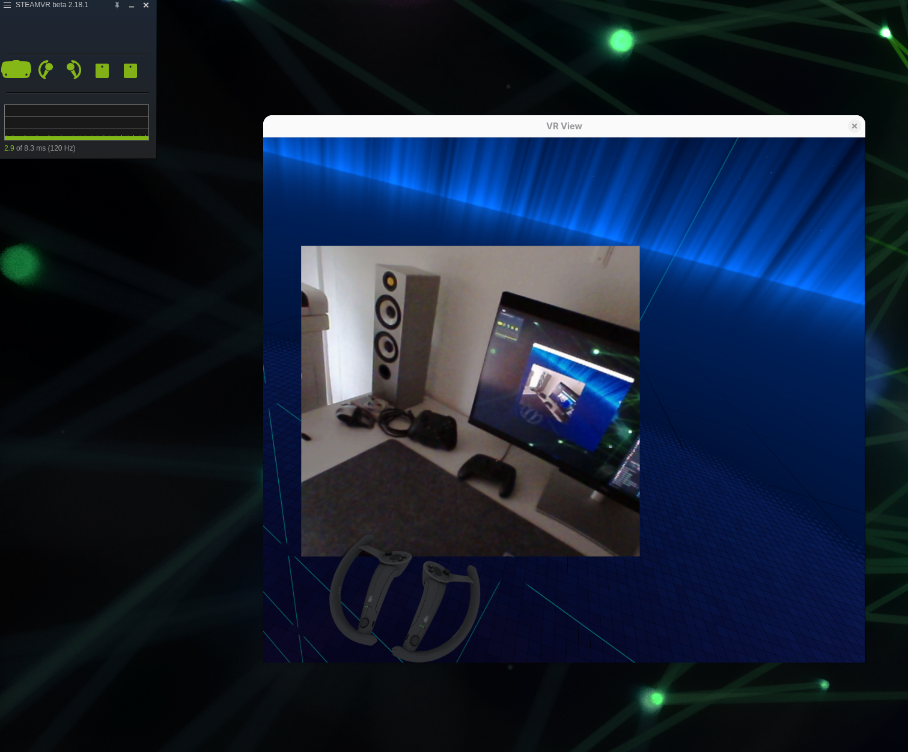
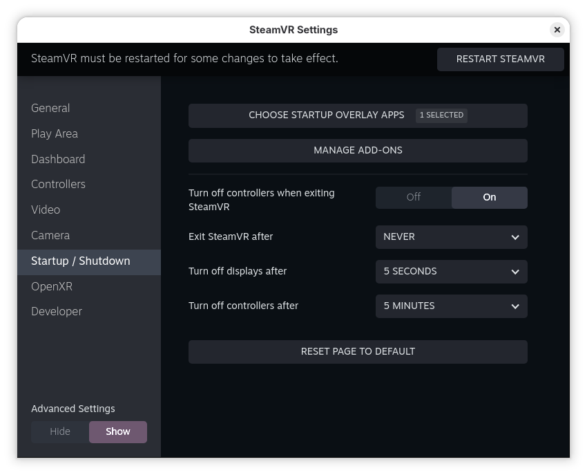
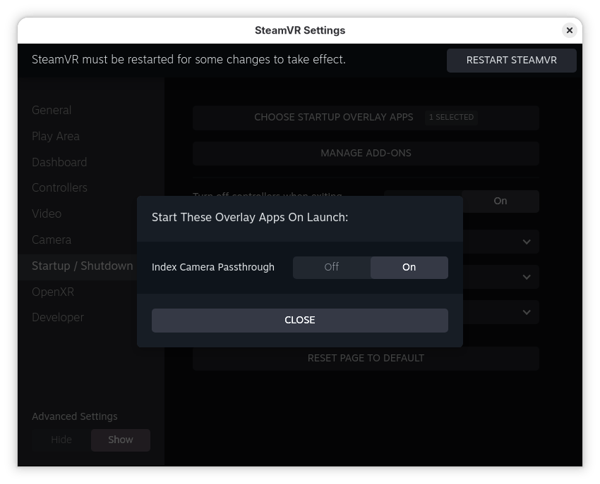

Index camera passthrough
========================

The problem that the Index camera doesn't work on Linux has been there for a long time, see [ValveSoftware/SteamVR-for-Linux#231](https://github.com/ValveSoftware/SteamVR-for-Linux/issues/231). And Valve will never address it.



The controllers are drawn by SteamVR in the VR scene, and continue in the camera image at the same place and at the same depth: what you see through the passthrough is where you expect it to be.

## Features

- Stereo overlay: the overlay in your game world that acts as a portal to real world. Meaning you see in 3D. A flat, non-3D view is also available.
- You can configure the overlay to be in one place, or stay in front of you.
- Use camera calibration data from your Steam installation.
- Show/hide passthrough with button presses.

See [the example config file](index-camera-passthrough.toml).

## Depth accuracy

With `depth = "auto"` in stereo mode, the depth of what is in the center of the view is estimated with stereo matching of the two cameras, and the scene is shown at that distance (see [the example config file](index-camera-passthrough.toml)). The depth estimation was checked against a tape measure on a Valve Index, measuring from the front of the headset to a flat printed box standing in front of it, at the 320x320 resolution used by the program:

| Distance (tape measure) | Estimated depth | Error |
|---|---|---|
| 0.45 m | 0.455 m | +0.5 cm (1.1%) |
| 0.80 m | 0.813 m | +1.3 cm (1.6%) |
| 1.36 m | 1.418 m | +5.8 cm (4.3%) |
| 2.58 m | 2.672 m | +9.2 cm (3.6%) |

The error grows with the distance because the farther a point is, the less its position differs between the two camera images: at 2.5 m the difference is only about 7 pixels at this resolution, so a fraction of a pixel is already a few centimeters. Most of the error is a constant offset of about 0.35 pixels, from a small inaccuracy of 0.14 degrees in the factory calibration of the cameras; corrected for it, the error is 3 mm RMS over the same range at full resolution. Plain surfaces, like white walls or cabinet doors, have no detail to match and get no depth, or a wrong one.

To check it on your headset, save a frame of the camera, for example with `ffmpeg -f v4l2 -input_format yuyv422 -video_size 1920x960 -i /dev/video0 -frames:v 1 frame.png`, then run `index-camera-passthrough --rectify frame.png --depth disparity.png`: the disparity map has the disparities in 1/16 pixels, the depth is 18.70 / disparity meters for a Valve Index.

## Usage

### Start automatically with SteamVR

Run `index-camera-passthrough` once while SteamVR is running. The first time, it registers itself in SteamVR as "Index Camera Passthrough" and enables its automatic start, and the log shows:

```
$ index-camera-passthrough
[...]
Registered in SteamVR, enabling the automatic start with SteamVR
```

From then on, SteamVR starts it when SteamVR starts, with the passthrough window hidden: press both B buttons (as described in [the example config file](index-camera-passthrough.toml)) to show it and hide it again. When you start the program yourself, the passthrough is shown right away, unless you start it with `--hidden`.

To disable the automatic start, open the SteamVR settings, show the advanced settings, and in Startup / Shutdown click Choose Startup Overlay Apps:



Then turn off Index Camera Passthrough:



### Run directly

To run this program, you can either

```
cargo run
```

or run the binary directly

```
./target/release/index-camera-passthrough
```

## Configuration

On first run, the default configuration is written to `~/.config/index-camera-passthrough/index-camera-passthrough.toml` (`$XDG_CONFIG_HOME/index-camera-passthrough/` if set), unless it already exists. See [the example config file](index-camera-passthrough.toml), which is the same file, for all the options. The program has to be restarted after changing it.

## Inspecting a camera frame

The program can run the processing of the passthrough on a saved camera frame, without SteamVR, to check how your cameras are corrected. It needs the camera calibration that SteamVR stores in `~/.local/share/Steam/config/lighthouse` when the headset is connected, and a Vulkan capable GPU.

Save a frame of the camera, while the passthrough is not running (the camera can only be used by one program at a time):

```
ffmpeg -f v4l2 -input_format yuyv422 -video_size 1920x960 -i /dev/video0 -frames:v 1 frame.png
```

Then run:

```
index-camera-passthrough --rectify frame.png
```

This writes `rectified.png` (change it with `--output`): the left and right camera images, side by side, with the distortion of the lenses removed and rectified, so that the same point of the scene is on the same row in both images. It also logs the depth of the center of the view, as used by `depth = "auto"`, then exits. Two more images can be written:

- `--depth disparity.png`: the disparity map of the left image, 320x320 16-bit grayscale, in 1/16 pixels; points without a match are 0. See [Depth accuracy](#depth-accuracy) to convert it to meters.
- `--project projection.png`: what each eye sees on an overlay 1 m ahead, with the scene at the distance of the overlay (top) and at the depth of the center of the view (bottom).

## Build instruction

Binaries for Fedora and Ubuntu are attached to the [releases](https://github.com/scaronni/index-camera-passthrough/releases).

To build this program, you need:

* Rust 1.89 or newer ([How to install](https://www.rust-lang.org/tools/install))
* clang, and the development packages of OpenVR, OpenXR, Vulkan, OpenCV, shaderc and udev:
  * Fedora: `clang-devel openvr-devel openxr-devel vulkan-loader-devel opencv-devel libshaderc-devel systemd-devel`
  * Debian / Ubuntu: `libclang-dev libopenvr-dev libopenxr-dev libvulkan-dev libopencv-dev libshaderc-dev libudev-dev`. Debian ships the shared shaderc library as `libshaderc.so`: point `SHADERC_LIB_DIR` to a directory with a `libshaderc_shared.so` link to it, as done in `.github/workflows/build.yaml`.

Then run, to build with both the OpenXR and the OpenVR backends:

```
cargo build --release
```
